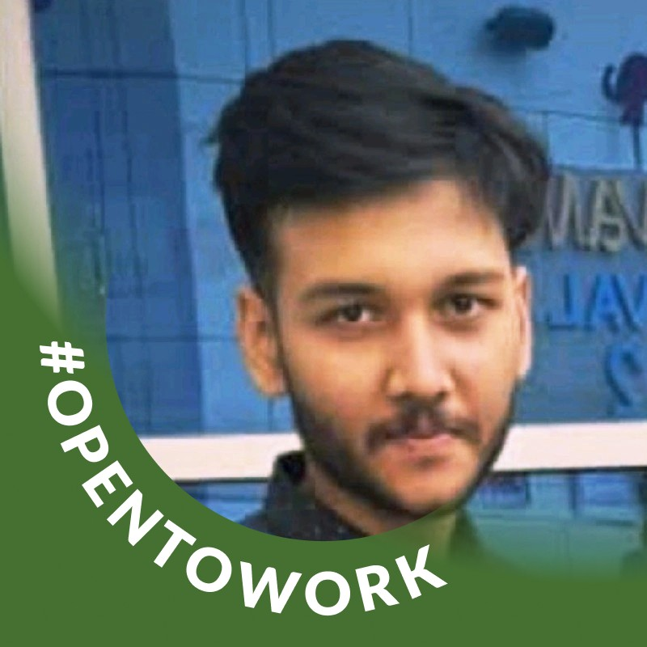

# <p align="center">✨Travel Website✨</p>
<p align="center">
   
<div align="center"> 
    <h1> 
         
    </h1>
</div>
   


 <div align="center">
 <p>

[](https://github.com/ellerbrock/open-source-badges/)


 </p>
 </div>

 <h2>Hi there👋, Enjoy the World of Open source contribution </h2>


<p>Hello Coders!!👨‍💻<br> I am Arpan Chowdhury, an aspiring Web developer🤖. Here is the project on front-end Web Development.</p>


<div id="top"></div>
<!--line-->


<h2>Table of Contents🧾</h2>

- [Overview📌](#overview)
- [Features🌟](#features)
- [Technology Used🚀](#technology-used)
- [Open-Source-Programmes⭐](#open-source-programmes)
- [Getting Started💥](#getting-started)
- [Contributing Guidelines📑](#contributing-guidelines)
- [Code Of Conduct📑](#code-of-conduct)
- [Project Admin⚡](#project-admin)
- [Contributing is fun🧡](#contributing-is-fun)
<br>
<!--line-->


<h2>Overview📌</h2>
<p>This repository contains my project on a Travel Website✈️ using HTML, CSS and JavaScript. It features a landing page for a travel tour company website. Finding the perfect travel destination can be a challenge. This project aims to streamline that process🚤. We welcome all contributions to make this a fantastic resource for travelers. Jump in and contribute to this grand project! Read the guidelines📚 and get started building!</p>

<h2>Live Demo</h2>

Check out the live project [here](https://apu52.github.io/Travel_Website/).

<p align="center">
  
</p>
<!--line-->


## Features🌟


- **🌐 Introductory Page** Welcomes visitors with an engaging overview, setting the tone for exploratio.

- **📍 Top Destinations*: Highlights popular travel spots with captivating images and detailed descriptios.

- **✈️ Best Trip Packages*: Offers curated travel packages tailored to various interests and budgets, complete with itineraries and pricig.

- **📸 Trip Gallery*: Showcases memorable moments from past trips in a visually appealing gallry.

- **📞 Contact Us Pag**: Provides essential contact information and inquiry forms for easy communicaion.

- **🗺️ Plan a Trp**: Assists users in planning their journeys with suggested destinations and pacages.

- **🔐 Login/SigUp**: Enables users to create accounts and access personalized fetures.

- **🧭 Adventure & Cultural Experieces**: Offers specialized pages for adventure seekers and cultural enthsiasts.

- **💖 Honeymoon Pacages**: Presents romantic getaway options for nwlyweds.

- **💰 Pricin Page**: Details various pricing options for different travelpackages.

- **🧳 To Deals**: Highlights the best travel deals available, ensuring valuefor money.

- **🌍 Dedicated Destnations**: Provides in-depth information on specific destinations to help travelers make infored choices.


<!--line-->


<h2>Technology Used🚀</h2>


<p align="right"><a href="#top"></a></p>

<!--line-->


<h2>Open-Source-Programmes⭐</h2>

 ### This project is now OFFICIALLY accepted for


### This project was part of following Open Source Programs


 <div align="center">
  
</div>
 
<div align="center">
  
</div>

<div align="center">
  
</div>

<div align="center">
  
</div>

<div align="center">
  
</div>

<div align="center">
  
</div>

<div align="center">
  
</div>

<!--line-->


<h2>Getting Started💥</h2>

<h3>Local Installation video</h3>

[video](https://drive.google.com/file/d/1LsBudIUtZLDMSlmBDdOfT001QRqGBSbN/view?usp=sharing)


## How to make a Pull Request?

**1.** Start by forking the [**Travel_Website**](https://github.com/apu52/Travel_Website) repository. Click on the <a href="https://github.com/apu52/Travel_Website/fork"></a> symbol at the top right corner.

**2.** Clone your forked repository:

```bash
git clone https://github.com/<your-github-username>/Travel_Website
```

**3.** Navigate to the new project directory:

```bash
cd Travel_Website
```

**4.** Set upstream command:

```bash
git remote add upstream https://github.com/apu52/Travel_Website
```

**5.** Create a new branch:

```bash
git checkout -b YourBranchName
```

<i>or</i>

```bash
git branch YourBranchName
git switch YourBranchName
```

**6.** Sync your fork or local repository with the origin repository:

- In your forked repository click on `Fetch upstream`.
- Click `Fetch and merge`.

### Alternatively, Git CLI way to Sync forked repository with origin repository:

```bash
git fetch upstream
```

```bash
git merge upstream/main
```

### [Github Docs](https://docs.github.com/en/github/collaborating-with-pull-requests/addressing-merge-conflicts/resolving-a-merge-conflict-on-github) for Syncing

**7.** Make your changes to the source code.

**8.** Stage your changes and commit:

⚠️ **Make sure** not to commit `package.json` or `package-lock.json` file

⚠️ **Make sure** not to run the commands `git add .` or `git add *`. Instead, stage your changes for each file/folder

```bash
git add file/folder
```

```bash
git commit -m "<your_commit_message>"
```

**9.** Push your local commits to the remote repository:

```bash
git push origin YourBranchName
```

**10.** Create a [Pull Request](https://help.github.com/en/github/collaborating-with-issues-and-pull-requests/creating-a-pull-request)!

 **Congratulations! You've made your first contribution! 🙌🏼**
<p align="right"><a href="#top"></a></p>

<!--line-->


<h2>Contributing Guidelines📑</h2>

To learn about our development process, how to propose bug fixes and improvements of our project please read our [Contributing Guidelines.](https://github.com/apu52/Travel_Website/blob/main/CONTRIBUTING.md)


<h2>Code Of Conduct📑</h2>

This project and everyone participating in it are governed by the [Code of Conduct](https://github.com/apu52/Travel_Website/blob/main/Code_of_conduct.md). By participating, you are expected to uphold this code.

</br>
<p align = "center">
Show some ❤️&nbsp; by giving  to this repository.
</p>

<div align="center">

<div align="center">
   
<!--line-->

   
## Project Mentor

<table>
<tr>
   
<td align="center"><a href="https://github.com/Ayushmaan06"></a></br> <h4 style="color:red;">Ayushmaan Singh</h4>
 <a href="https://www.linkedin.com/in/ayushmaan03/"></img></a>
</td>
   
<td align="center"><a href="https://github.com/KrishnenduDG"></a></br> <h4 style="color:red;">Krishnendu Dasgupta</h4>
 <a href="https://www.linkedin.com/in/krishnendu-dasgupta-450391186/"></img></a>
</td>

<td align="center"><a href="https://github.com/itsekta"></a></br> <h4 style="color:red;">Ekta Chaudhary</h4>
 <a href="https://www.linkedin.com/in/ekta-software-engineer/"></img></a>
</td>

<td align="center"><a href="https://github.com/Ghanshyam89"></a></br> <h4 style="color:red;">Ghanshyam Prajapati</h4>
 <a href="https://www.linkedin.com/in/ghanshyam-prajapati/"></img></a>
</td>
</tr>
</table>

<!--line-->


 # Project Admin⚡
 
<table>
<tr>
<td align="center"><a href="https://github.com/apu52"></a></br> <h4 style="color:red;">Arpan Chowdhury</h4>
 <a href="https://www.linkedin.com/in/arpan-chowdhury-775294251/"></img></a>
   </td>

</tr>
</table>
  
</div>


<!--line-->


## Contributing is fun🧡
<p align ="center">
  
</p>

<!--line-->


## Acknowledgements

Thank you to all the amazing contributors who have made this project possible! 💝

<p align ="center">
  
</p>

<a href="https://github.com/apu52/Travel_Website/graphs/contributors">
  
</a> 
<br><br>

<!--line-->


## License

This project is licensed under the MIT License. See the [LICENSE](LICENSE) file for more details.

<p align="center">
  
</p>


<p align="right"><a href="#top"></a></p>


